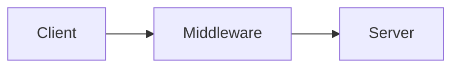
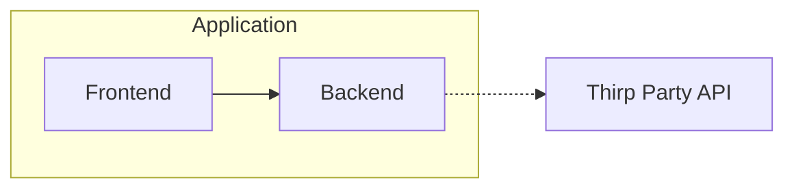

# Web Sockets Test
Simple demo using Web Sockets verify how they work

# Case 1: Simple console application 
Simple application that simulates a complex system that has a middleware and a backend.
The client creates a socket connection with the backend and goes through the middleware

# Case 2: Web Sockets with FastAPI
Use FastAPI as a backend and publish a Web Socket endpoint (wss)

The idea (for future cases) is to use the FastAPI as a middleware to allow connections to thrid party services that use Web Socket as connection protocol and avoid connecting directly the frontend client with third party service.

