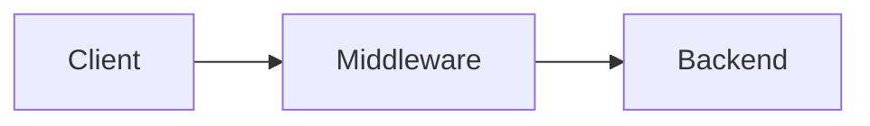

# Web Sockets Test
Simple demo using Web Sockets verify how they work

# Case 1: Simple console application 
Simple application that simulates a complex system that has a middleware and a backend.
The client creates a socket connection with the backend and goes through the middleware

